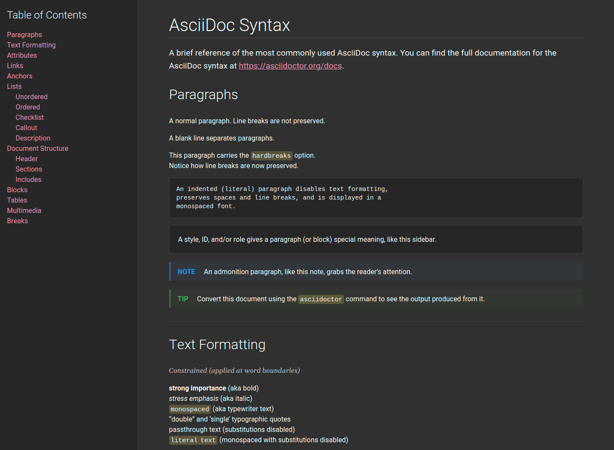

= Asciidoctor Styles
Amit Mendapara
:nofooter:
:url-source: https://github.com/cristatus/asciidoctor-styles
:url-asciidoctor: https://asciidoctor.org
:url-asciidoctor-factory: https://github.com/asciidoctor/asciidoctor-stylesheet-factory

The purpose of this project is to provide an alternative {url-asciidoctor}[asciidoctor]
stylesheet which is easy to integrate with other css frameworks or designs.

The project provides a new stylesheet `asciidoctor-next.css` based on material design color palette
and supports light and dark modes.

== How to build

To setup the project, make sure you have Node installed.
Next, run `npm` to install the required Node modules:

 $ npm i

Once the Node modules installed, you can build the stylesheets with following commands:

 $ npm run build

This command will create [.path]_asciidoctor-next.css_ and [.path]_asciidoctor-next.min.css_
in the [.path]_css_ folder.

== How to develop

Run rhe following command when you are working with the source:

 $ npm run watch

It will automatically build css files and generate example docs for testing.

== Screenshots

== License

The theme is released under MIT license and partially based on the original
{url-asciidoctor-factory}[asciidoctor-stylesheet-factory] which is again licensed under the
same MIT license.
